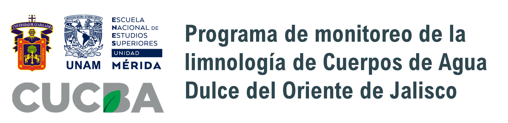

# Programa de monitoreo de la limnología de Cuerpos de Agua Dulce de Occidente de Jalisco

Repositorio del programa de monitoreo de las características fisicoquímicas y biológicas de cuerpos de agua continentales de Jalisco por parte del *Instituto de Limnología* de la **Universidad de Guadalajara** en colaboración con la *Escuela Nacional de Estudios Superiores Unidad Mérida* de la **Universidad Nacional Autónoma de México**. Además, se emplean datos de calidad de agua de libre acceso proporcionados por la *Comisión Estatal del Agua en Jalisco*. 

## Objetivo
Evaluar el estado de estos cuerpos de agua como reservas para el suministro en comunidades aledañas, así como generar información básica para el estudio de poblaciones de organismos de interés.

## Contenido
Se consideran los siguientes cuerpos de agua:
-Laguna de Cajititlán
-Laguna de Zapotlán
-Río Verde
-Río Zula-Lerma
-Río Santiago

### Para todos los cuerpos de agua:
-Variables ambientales:
 -pH, temperatura, transparencia, turbiedad, profundidad.
 -Oxigenación, conductividad, DQO, DBO, sólidos suspendidos, alcalinidad.
 -Cloruros, fluoruros, fósforo, nitritos, nitratos, sulfatos.
 -Metales presentes (Al, As, Ba, Cu, Mn, Pb, Na, Zn).
-Código empleado en `R` para cargar, ordenar, curar y visualizar los datos.
Disponible como datos `crudos`, formato `rectangular` y formato `tidy`.

### Para la Laguna de Cajititlán:
-Variables biológicas: 
 -Grupos fitoplanctónicos 
 -Grupos zooplanctónicos (Diplostraca, Rotifera, Cyclopoida, Calanoida).  
Disponible como datos `crudos`, formato`rectangular` y formato `tidy`.

## Participan:
- M. C. Eduardo Juárez Carrillo, Director del Instituto de Limnología de la Universidad de Guadalajara, (CUCBA-UDG)
- M. C. Martha Alicia Lara Navarro, Centro Universitario de Ciencias Biológicas y Agropecuarias (CUCBA-UDG)
- Dr. Edlin Guerra Castro, Escuela Nacional de Estudios Superiored Unidad Mérida (ENES-UNAM)
- Cristofer Camarena Orozco, estudiante de licenciatura, responsable del repositorio (camarenaocristofer@gmail.com)
